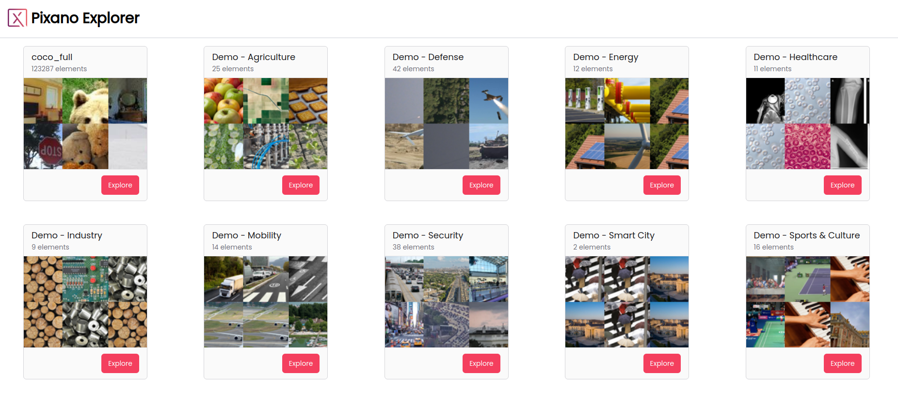
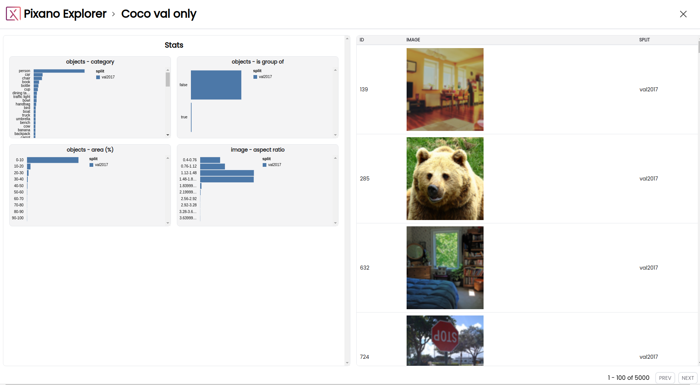
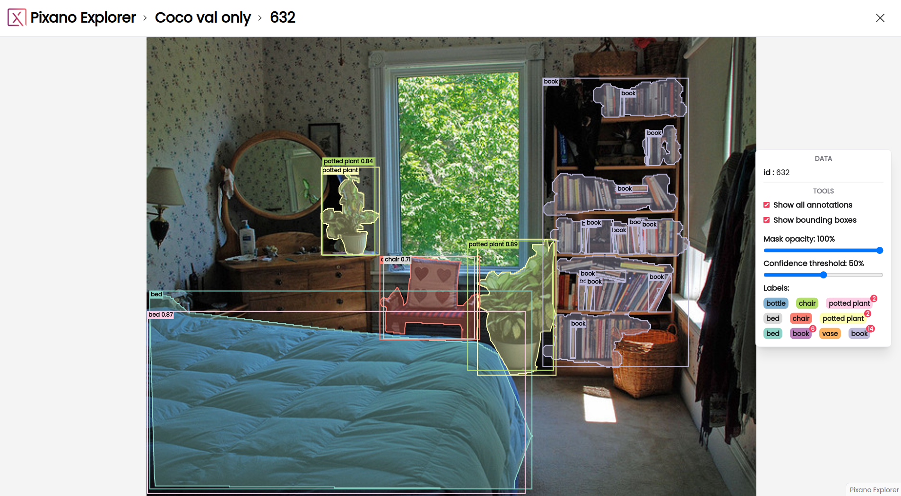

# Using Pixano Explorer

## Home page

From the Explorer home page, you will be greeted with a list of all the Pixano format datasets found in the directory you provided.

For each dataset, you can see its name, the number of elements inside it, and a thumbnail composed from six sample elements.

You can hover over a dataset name to check the dataset description if it has one.

You can click on a dataset to open its exploration page.

## Exploration page

### Statistics

Available statistics will be displayed on the left side of the dataset page.

You can hover over different elements in the statistics to get more detailed information.

*Filtering your dataset based on the selected statistics will soon be available.*

### Elements list

The dataset elements will be displayed on the right side of the dataset page.

Elements are displayed in scrollable pages of up to 100 elements.

You can navigate between pages with the *Previous* and *Next* buttons at the bottom.

You can click on any element to open it in the exploration page.

For each element, you can see columns for its ID, a thumbnail for each of its media, and the split it comes from.

*Filtering your dataset based on these columns will soon be available.*

### Going home

To go back to the home page, click on "Pixano Annotator" in the top left or on the *Close* icon in the top right.

## Element view page

### Element view

The selected element (image or images for multi-view datasets) is displayed.

You can zoom in and out with the mouse wheel.

You can grab and move images.

You can double click on an image to move it above other images.

Annotations, in form of segmentations mask and bounding boxes, are displayed.
Each object category is given a color.

For bounding boxes, you can see the category, and the bounding box confidence in case of inferences, on their top left corners.

### Right toolbar

A *toolbar* is available on the right side of the page with the following sections:

- A ***Data*** section to display information on the element, like its ID

- A ***Tools*** section to filter the annotations
    - The *Show all annotations* checkbox allows you to toggle annotations visibility
    - The *Show bounding boxes* checkbox allows you to toggle bounding box visibility
    - The *Mask opacity* slider allows you to adjust the opacity of segmentations masks
    - The *Confidence threshold* slider allows you to adjust the threshold displaying inferences
    - The *Labels* list allows you to see the number of annotations for any label, and to toggle annotations visibility for individual labels by click on their names

*More options to display ground truths and inference annotations separately and with different colors will be coming soon.*

*More options for multi-view datasets will be coming soon.*

### Going home

To go back to the home page, click on "Pixano Annotator" in the top left.

To go back to the exploration page, click on the dataset name in the top left or on the *Close* icon in the top right, or press the *Esc* key.