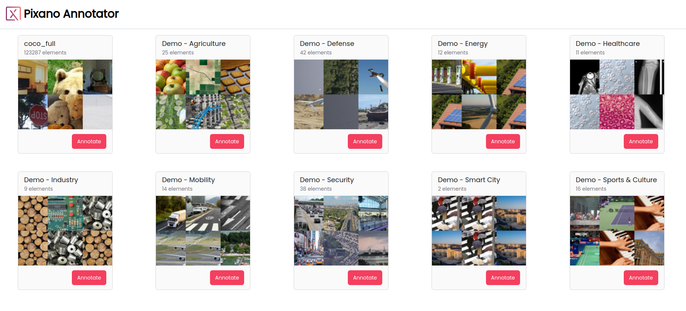
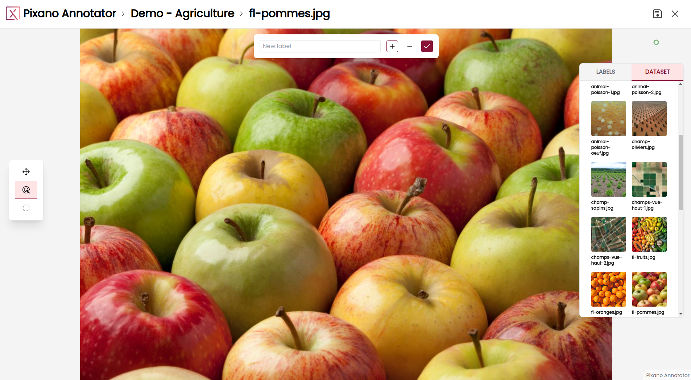

# Using Pixano Annotator

## Home page

From the Annotator home page, you will be greeted with a list of all the Pixano format datasets found in the directory you provided.

For each dataset, you can see its name, the number of elements inside it, and a thumbnail composed from six sample elements.

You can hover over a dataset name to check the dataset description if it has one.

You can click on a dataset to open its annotation page on its first element.

## Annotation page

### Element view

The selected element (image or images for multi-view datasets) is displayed.

You can zoom in and out with the mouse wheel.

You can grab and move images with the middle click or with the **_Pan_** tool available in the left-hand _toolbar_.

You can double click on an image to move it above other images.

Annotations, in form of segmentation mask, are displayed.
Each object category is given a color.

On the top of the image, when you have an input Tool selected, a panel is displayed that allows to choose a category.

### Left toolbar

A _toolbar_ is available on the left-hand side of the page with the following tools:

- **_Pan_**: Allows you to grab and move an image
- **_Points_**: Allows you to place input points to interactively segment your image
  - You can place positive points with the **+** tool (points shown in green) to indicate what must be included in the segmentation
  - You can place negative points with **-** tool (points shown in red) to indicate what must not be included in the segmentation
  - You can hover over any point and press the _Del_ key to remove it
  - You can click and hold on any point to relocate it
- **_Rectangle_**: Allows you to draw rectangles approximatively around the objects of interest to interactively segment them
  - You can click and drag on the image to draw a rectangle
  - There can only be one rectangle at a time, so drawing a new rectangle will discard the previous one. You have to validate the obtained segmentation, if satisfactory, before drawing a new rectangle

The **_Points_** and **_Rectangle_** tools depend on an ONNX segmentation model you have to provide. Please look at the interactive annotation documentation and notebook for more information.

_More tools will be coming soon._

### Center toolbar

When an annotation tool is selected, a _toolbar_ is available at the center on the page.

Enter the label name for your annotation in the text box or select the label from the list of existing labels.

If the **_Points_** tool is selected, a **+** icon and a **-** icon allow to quickly switch between positive and negative points

Validate your annotation with the entered label by cliking on the Validate icon, or press _Enter_ key.

### Right toolbar

A _toolbar_ is available on the right side of the page with the following tabs:

- **_Labels_**: This tab displays your annotations grouped by views and by labels
  - Each annotation group can be opened or closed by clicking on it
  - Each annotation and annotation group can be shown or hidden on the relevant image by clicking on the _Visibility_ icon
  - Each annotation can be deleted by clicking on the _Delete_ icon
  - Each annotation is represented by its unique ID.
- **_Dataset_**: This tab allows you to navigate through the dataset
  - Each element of the dataset is displayed with its ID and its thumbnail
  - The list will automatically expand as you scroll down
  - You can click on any element to change the current element

### Annotating

You can currently annotate with the **_Points_** (**+** and **-**), and **_Rectangle_** tools available in the left toolbar as described above.

When using these tools, the generated annotation will be displayed in green. You can use both tools together to refine your annotation.

You can press the _Enter_ key or click the Validate icon of the center toolbar to validate your annotation.
You can press the _Esc_ key to reset all your **_Points_** and **_Rectangle_** inputs.

### Saving

To save your annotations, a _Save_ icon is available in the top right-hand corner. It will be highlighted if there are unsaved changes.

If you try to go back to the home page or change element with unsaved changes, you will see a confirmation window. You can choose "OK" to discard your changes, or cancel to be able to go back save them.

### Going home

To go back to the home page, click on "Pixano Annotator" in the top left-and corner or on the _Close_ icon in the top right-hand corner.
